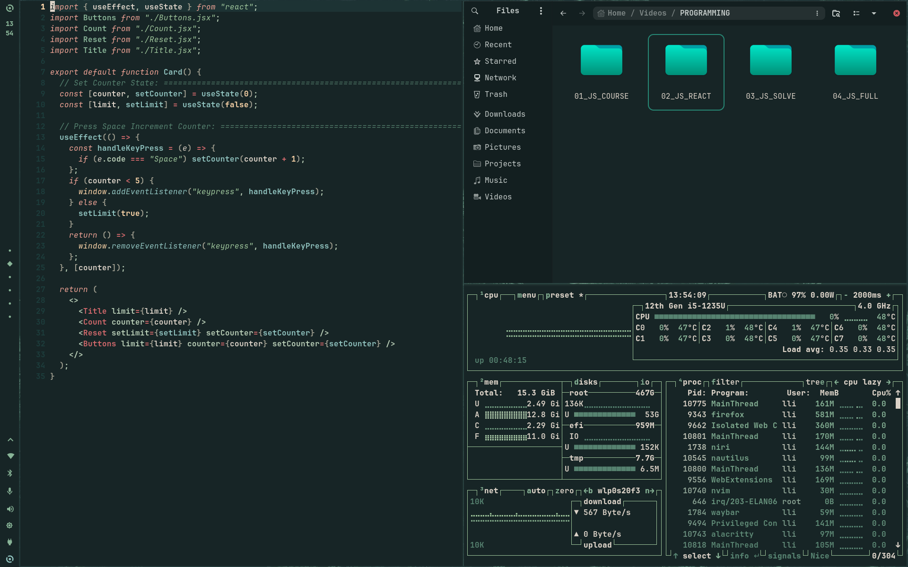

# Compositor: Niri WM

<div align="center">

**A productive and clean [Niri](https://github.com/YaLTeR/niri) configuration setup**
_Dynamic theming • Borderless layouts • Minimal_

---

### Gallery

<table>
  <tr>
    <td></td>
  </tr>
</table>

---

</div>

## Contents

- [Features](#features)
- [Automatic Installation](#automatic-installation-recommended)
- [What Gets Installed](#what-gets-installed)
- [Themes](#themes)
- [Preconfigured Tools](#preconfigured-tools)
- [Keybinds](#keybinds)
  - [System & Shortcuts](#system--shortcuts)
  - [Applications](#applications)
  - [Media Controls](#media-controls)
  - [Window Management](#window-management)
  - [Workspace Management](#workspace-management)
  - [Monitor Management](#monitor-management)
  - [Layout Controls](#layout-controls)
  - [Window Modes](#window-modes)
  - [Utilities](#utilities)

## Features

- Clean borderless, gapless minimal look
- Dynamic theme switching system-wide
- Out-of-Box preconfigured for all popular themes and applications
- Rust-powered tooling and packages (rust go brrr...)

## Automatic Installation (Recommended)

For Void Linux distributions:

```bash
cd way.dots/void-config && ./1_void-pkg.sh && ./2_void-extra.sh && ./3_void-cfg.sh
```

**Important Requirements:**

```
  Fresh or minimal Void Linux installation recommended
  Active internet connection required
  Sudo privileges needed
  At least 5GB free disk space
```

What the Script Does

The automated installer will:

```
   Install base development tools (git, base-devel, curl)
   Install all required packages (niri, waybar, fish, etc.)
   Install Drivers packages (mesa-intel-dri intel-video-accel intel-ucode, etc.)
   Install GTK themes (Macro, Rose Pine, Osaka)
   Install icon themes (Papirus icons)
   Clone and configure dotfiles
   Set up shell configuration (bash/elvish)
   enabled services
   Install wallpapers
```

Installation Time: Approximately 15-30 minutes depending on your internet speed.

# What Gets Installed

Core Components

    Window Manager: Niri (Scrollable-tiling Wayland compositor)
    Status Bar: Waybar (Highly customizable)
    Terminal: Alacritty, Foot
    Shell: elvish (with optional bash)
    Notification Daemon: Fnott
    Application Launcher: yazi
    Screen Locker: swaylock
    Wallpaper Manager: swww awww

Additional Tools

    Editor: Neovim (preconfigured)
    File Manager: Yazi (TUI), Nautilus (GUI)
    PDF Viewer: Zathura
    System Info: Fastfetch
    Theme Manager: Wallust
    Prompt: Starship
    Authentication: Polkit-gnome
    Utilities: dust, eza, niri-switch

Development Tools

    Base development packages
    Git and build essentials

## Themes

[Wallust](https://codeberg.org/explosion-mental/wallust) is used for the theming using it's color palettes and it's palette generation using wallpaper.

| Theme      | GTK Theme                                                                                   | Icon Theme                                                                           |
| ---------- | ------------------------------------------------------------------------------------------- | ------------------------------------------------------------------------------------ |
| Catppuccin | [Colloid (Light/Dark) Catppuccin](https://github.com/vinceliuice/Colloid-gtk-theme)         | [Colloid Catppuccin (Light/Dark)](https://github.com/vinceliuice/Colloid-icon-theme) |
| Everforest | [Colloid (Light/Dark) Everforest](https://github.com/vinceliuice/Colloid-gtk-theme)         | [Colloid Everforest (Light/Dark)](https://github.com/vinceliuice/Colloid-icon-theme) |
| Gruvbox    | [Colloid (Light/Dark) Gruvbox](https://github.com/vinceliuice/Colloid-gtk-theme)            | [Colloid Gruvbox (Light/Dark)](https://github.com/vinceliuice/Colloid-icon-theme)    |
| Nord       | [Colloid (Light/Dark) Nord](https://github.com/vinceliuice/Colloid-gtk-theme)               | [Colloid Nord (Light/Dark)](https://github.com/vinceliuice/Colloid-icon-theme)       |
| Rosé Pine  | [Rose Pine GTK Theme (Light/Dark)](https://github.com/Fausto-Korpsvart/Rose-Pine-GTK-Theme) | [Colloid Catppuccin (Light/Dark)](https://github.com/vinceliuice/Colloid-icon-theme) |
| Dracula    | [Colloid (Light/Dark) Dracula](https://github.com/vinceliuice/Colloid-gtk-theme)            | [Colloid Dracula (Light/Dark)](https://github.com/vinceliuice/Colloid-icon-theme)    |
| Material   | [Colloid Grey (Light/Dark)](https://github.com/vinceliuice/Colloid-gtk-theme)               | [Colloid (Light/Dark)](https://github.com/vinceliuice/Colloid-icon-theme)            |
| Solarized  | [Osaka GTK Theme (Light/Dark)](https://github.com/Fausto-Korpsvart/Osaka-GTK-Theme)         | [Colloid Everforest (Light/Dark)](https://github.com/vinceliuice/Colloid-icon-theme) |

Thanks to [vinceliuice](https://github.com/vinceliuice) and [Fausto-Korpsvart](https://github.com/Fausto-Korpsvart) for providing awesome GTK themes.

## Preconfigured Tools

- Neovim
- Yazi
- Rofi
- Waybar
- Fish
- Fastfetch
- Mako
- Alacritty
- Kitty
- Starship

## Keybinds

> **Note:** `MOD` key is the Super/Windows key by default.

### System & Shortcuts

## ⌨️ Keybinds

> **Note:** The `MOD` key is set to **Super/Windows** by default.

### 🚀 Applications & System

| Keybind                | Action                            |
| :--------------------- | :-------------------------------- |
| `MOD + Return`         | Open Terminal (**Alacritty**)     |
| `MOD + Shift + Return` | Open Terminal (**Foot**)          |
| `MOD + W`              | Open Browser (**Firefox**)        |
| `MOD + D`              | Application Launcher (**Fuzzel**) |
| `MOD + Shift + N`      | File Manager (**Nautilus**)       |
| `MOD + N`              | TUI File Manager (**Yazi**)       |
| `MOD + B`              | Bluetooth Manager (**Bluetui**)   |
| `MOD + I`              | Wi-Fi Manager (**Impala**)        |
| `MOD + Super + L`      | Lock Screen (**Swaylock**)        |
| `MOD + Shift + Escape` | Toggle Hotkey Overlay             |
| `MOD + Shift + Q`      | Quit Niri (Immediate)             |

### 📋 Scripts & Utilities

| Keybind           | Action                           |
| :---------------- | :------------------------------- |
| `MOD + Shift + P` | Power Menu                       |
| `MOD + Shift + C` | Clipboard History (**Cliphist**) |
| `MOD + Shift + W` | Niri Modules Menu                |
| `MOD + P`         | Color Picker (Hex to Clipboard)  |
| `MOD + Super + W` | Restart **Waybar**               |
| `Print`           | Take Screenshot                  |
| `MOD + Print`     | Screenshot Entire Screen         |

### 🪟 Window Management

| Keybind               | Action                             |
| :-------------------- | :--------------------------------- |
| `MOD + Q`             | Close Active Window                |
| `MOD + H / L`         | Focus Column Left / Right          |
| `MOD + J / K`         | Focus Workspace Down / Up          |
| `MOD + Shift + H / L` | Move Column Left / Right           |
| `MOD + Shift + J / K` | Move Column to Workspace Down / Up |
| `MOD + Home / End`    | Focus First / Last Column          |
| `MOD + Shift + Space` | Toggle Floating Mode               |
| `MOD + F`             | Maximize Window                    |
| `MOD + Shift + F`     | Fullscreen Window                  |

### 📏 Layout Controls

| Keybind               | Action                            |
| :-------------------- | :-------------------------------- |
| `MOD + R`             | Cycle Preset Column Widths        |
| `MOD + [ / ]`         | Fine-tune Column Width (-/+ 10%)  |
| `MOD + Shift + [ / ]` | Fine-tune Window Height (-/+ 10%) |
| `MOD + Ctrl + C`      | Center Visible Columns            |
| `MOD + T`             | Toggle Tabbed Column View         |

### 🖱️ Mouse Bindings

| Keybind                      | Action                   |
| :--------------------------- | :----------------------- |
| `MOD + Scroll Up/Dn`         | Switch Workspace         |
| `MOD + Shift + Scroll Up/Dn` | Move Column to Workspace |
| `MOD + Ctrl + Scroll Up/Dn`  | Adjust Window Height     |
| `MOD + Scroll Left/Right`    | Switch Column            |

---
