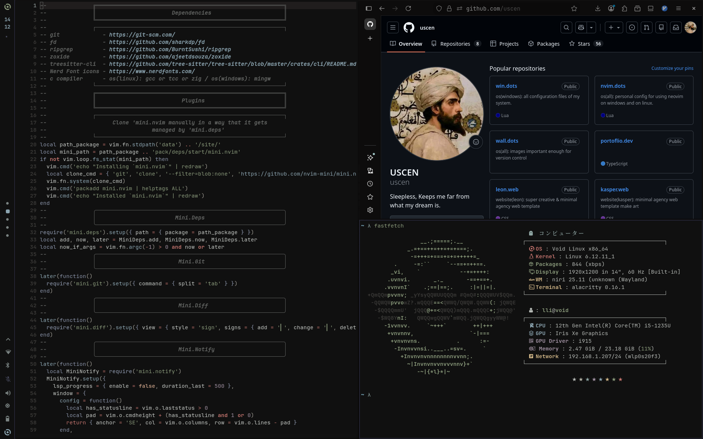

# Compositor: Niri WM

<div align="center">

**A productive and clean [Niri](https://github.com/YaLTeR/niri) configuration setup**
_Dynamic theming • Borderless layouts • Minimal_

---

### Gallery

<table>
  <tr>
    <td></td>
  </tr>
</table>

---

</div>

## Contents

- [Features](#features)
- [Automatic Installation](#automatic-installation-recommended)
- [What Gets Installed](#what-gets-installed)
- [Themes](#themes)
- [Preconfigured Tools](#preconfigured-tools)
- [Keybinds](#keybinds)
  - [System & Shortcuts](#system--shortcuts)
  - [Applications](#applications)
  - [Media Controls](#media-controls)
  - [Window Management](#window-management)
  - [Workspace Management](#workspace-management)
  - [Monitor Management](#monitor-management)
  - [Layout Controls](#layout-controls)
  - [Window Modes](#window-modes)
  - [Utilities](#utilities)

## Features

- Clean borderless, gapless minimal look
- Dynamic theme switching system-wide
- Out-of-Box preconfigured for all popular themes and applications
- Rust-powered tooling and packages (rust go brrr...)

## Automatic Installation (Recommended)

For Arch Linux and Arch-based distributions (Manjaro, EndeavourOS, etc.):

```bash
curl -fsSL https://raw.githubusercontent.com/saatvik333/niri-dotfiles/main/install.sh | sh
```

**Important Requirements:**

```
  Fresh or minimal Arch Linux installation recommended
  Active internet connection required
  Sudo privileges needed
  At least 5GB free disk space
```

What the Script Does

The automated installer will:

```
   Verify system compatibility (Arch-based only)
   Update your system packages
   Install base development tools (git, base-devel, curl)
   Set up AUR helper (yay)
   Configure Rust toolchain
   Install all required packages (niri, waybar, fish, etc.)
   Install AUR packages (vicinae, wallust, etc.)
   Install GTK themes (Colloid, Rose Pine, Osaka)
   Install icon themes (Colloid icons)
   Clone and configure dotfiles
   Set up shell configuration (Fish/Zsh)
   Create systemd services
   Install wallpapers
   Backup existing configurations
```

Installation Time: Approximately 15-30 minutes depending on your internet speed.

# What Gets Installed

Core Components

    Window Manager: Niri (Scrollable-tiling Wayland compositor)
    Status Bar: Waybar (Highly customizable)
    Terminal: Alacritty, Foot
    Shell: Fish (with optional Zsh)
    Notification Daemon: Fnott
    Application Launcher: yazi
    Screen Locker: swaylock
    Wallpaper Manager: awww

Additional Tools

    Editor: Neovim (preconfigured)
    File Manager: Yazi (TUI), Nautilus (GUI)
    PDF Viewer: Zathura
    System Info: Fastfetch
    Theme Manager: Wallust
    Prompt: Starship
    Authentication: Polkit-gnome
    Utilities: dust, eza, niri-switch

Development Tools

    Rust toolchain (rustup, cargo)
    Base development packages
    Git and build essentials

## Themes

[Wallust](https://codeberg.org/explosion-mental/wallust) is used for the theming using it's color palettes and it's palette generation using wallpaper.

| Theme      | GTK Theme                                                                                   | Icon Theme                                                                           |
| ---------- | ------------------------------------------------------------------------------------------- | ------------------------------------------------------------------------------------ |
| Catppuccin | [Colloid (Light/Dark) Catppuccin](https://github.com/vinceliuice/Colloid-gtk-theme)         | [Colloid Catppuccin (Light/Dark)](https://github.com/vinceliuice/Colloid-icon-theme) |
| Everforest | [Colloid (Light/Dark) Everforest](https://github.com/vinceliuice/Colloid-gtk-theme)         | [Colloid Everforest (Light/Dark)](https://github.com/vinceliuice/Colloid-icon-theme) |
| Gruvbox    | [Colloid (Light/Dark) Gruvbox](https://github.com/vinceliuice/Colloid-gtk-theme)            | [Colloid Gruvbox (Light/Dark)](https://github.com/vinceliuice/Colloid-icon-theme)    |
| Nord       | [Colloid (Light/Dark) Nord](https://github.com/vinceliuice/Colloid-gtk-theme)               | [Colloid Nord (Light/Dark)](https://github.com/vinceliuice/Colloid-icon-theme)       |
| Rosé Pine  | [Rose Pine GTK Theme (Light/Dark)](https://github.com/Fausto-Korpsvart/Rose-Pine-GTK-Theme) | [Colloid Catppuccin (Light/Dark)](https://github.com/vinceliuice/Colloid-icon-theme) |
| Dracula    | [Colloid (Light/Dark) Dracula](https://github.com/vinceliuice/Colloid-gtk-theme)            | [Colloid Dracula (Light/Dark)](https://github.com/vinceliuice/Colloid-icon-theme)    |
| Material   | [Colloid Grey (Light/Dark)](https://github.com/vinceliuice/Colloid-gtk-theme)               | [Colloid (Light/Dark)](https://github.com/vinceliuice/Colloid-icon-theme)            |
| Solarized  | [Osaka GTK Theme (Light/Dark)](https://github.com/Fausto-Korpsvart/Osaka-GTK-Theme)         | [Colloid Everforest (Light/Dark)](https://github.com/vinceliuice/Colloid-icon-theme) |

Thanks to [vinceliuice](https://github.com/vinceliuice) and [Fausto-Korpsvart](https://github.com/Fausto-Korpsvart) for providing awesome GTK themes.

## Preconfigured Tools

- Neovim
- Yazi
- Rofi
- Waybar
- Fish
- Fastfetch
- Mako
- Alacritty
- Kitty
- Starship

## Keybinds

> **Note:** `MOD` key is the Super/Windows key by default.

### System & Shortcuts

| Keybind                | Action                                |
| ---------------------- | ------------------------------------- |
| `MOD + Shift + Escape` | Show hotkey overlay (shortcuts panel) |

### Applications

| Keybind              | Action                                           |
| -------------------- | ------------------------------------------------ |
| `MOD + Return`       | Open terminal (Alacritty)                        |
| `MOD + Alt + Return` | Open terminal (Kitty)                            |
| `MOD + B`            | Open primary browser (Firefox Developer Edition) |
| `MOD + Alt + B`      | Open secondary browser (Google Chrome)           |
| `MOD + A`            | Toggle application launcher (Vicinae)            |
| `MOD + E`            | Open file manager (Thunar)                       |
| `MOD + Alt + E`      | Open TUI file manager (Yazi)                     |
| `MOD + W`            | Open wallpaper selector                          |
| `MOD + Shift + Q`    | Lock screen (GTKLock)                            |

### Media Controls

| Keybind                 | Action                     |
| ----------------------- | -------------------------- |
| `XF86AudioRaiseVolume`  | Increase volume            |
| `XF86AudioLowerVolume`  | Decrease volume            |
| `XF86AudioMute`         | Mute/unmute audio          |
| `XF86AudioMicMute`      | Mute/unmute microphone     |
| `XF86MonBrightnessUp`   | Increase screen brightness |
| `XF86MonBrightnessDown` | Decrease screen brightness |
| `XF86AudioPlay`         | Play/pause media           |
| `XF86AudioPause`        | Play/pause media           |
| `XF86AudioNext`         | Next track                 |
| `XF86AudioPrev`         | Previous track             |

> **Note:** All media keys work even when the screen is locked.

### Window Management

#### Focus Windows

| Keybind                    | Action                             |
| -------------------------- | ---------------------------------- |
| `MOD + H` or `MOD + Left`  | Focus window/column left           |
| `MOD + J` or `MOD + Down`  | Focus workspace down / window down |
| `MOD + K` or `MOD + Up`    | Focus workspace up / window up     |
| `MOD + L` or `MOD + Right` | Focus window/column right          |
| `MOD + Home`               | Focus first column                 |
| `MOD + End`                | Focus last column                  |
| `MOD + Q`                  | Close focused window               |

#### Move Windows

| Keybind                                    | Action                                           |
| ------------------------------------------ | ------------------------------------------------ |
| `MOD + Shift + H` or `MOD + Shift + Left`  | Move column left                                 |
| `MOD + Shift + J` or `MOD + Shift + Down`  | Move column to workspace down / move window down |
| `MOD + Shift + K` or `MOD + Shift + Up`    | Move column to workspace up / move window up     |
| `MOD + Shift + L` or `MOD + Shift + Right` | Move column right                                |
| `MOD + Shift + Home`                       | Move column to first position                    |
| `MOD + Shift + End`                        | Move column to last position                     |

#### Mouse Navigation

| Keybind                     | Action                        |
| --------------------------- | ----------------------------- |
| `MOD + Scroll Down`         | Focus workspace down          |
| `MOD + Scroll Up`           | Focus workspace up            |
| `MOD + Scroll Right`        | Focus column right            |
| `MOD + Scroll Left`         | Focus column left             |
| `MOD + Shift + Scroll Down` | Move column to workspace down |
| `MOD + Shift + Scroll Up`   | Move column to workspace up   |
| `MOD + Ctrl + Scroll Right` | Move column right             |
| `MOD + Ctrl + Scroll Left`  | Move column left              |

### Workspace Management

#### Navigate Workspaces

| Keybind        | Action                        |
| -------------- | ----------------------------- |
| `MOD + 1-9`    | Switch to workspace 1-9       |
| `MOD + Tab`    | Switch to previous workspace  |
| `MOD + Escape` | Toggle overview mode          |
| `Alt + Tab`    | Window switcher (niri-switch) |

#### Move Windows to Workspaces

| Keybind             | Action                       |
| ------------------- | ---------------------------- |
| `MOD + Shift + 1-9` | Move window to workspace 1-9 |

### Monitor Management

#### Focus Monitors

| Keybind                                  | Action              |
| ---------------------------------------- | ------------------- |
| `MOD + Ctrl + H` or `MOD + Ctrl + Left`  | Focus monitor left  |
| `MOD + Ctrl + L` or `MOD + Ctrl + Right` | Focus monitor right |
| `MOD + Ctrl + K` or `MOD + Ctrl + Up`    | Focus monitor up    |
| `MOD + Ctrl + J` or `MOD + Ctrl + Down`  | Focus monitor down  |

#### Move Windows to Monitors

| Keybind                                                  | Action                       |
| -------------------------------------------------------- | ---------------------------- |
| `MOD + Shift + Ctrl + H` or `MOD + Shift + Ctrl + Left`  | Move window to monitor left  |
| `MOD + Shift + Ctrl + L` or `MOD + Shift + Ctrl + Right` | Move window to monitor right |
| `MOD + Shift + Ctrl + K` or `MOD + Shift + Ctrl + Up`    | Move window to monitor up    |
| `MOD + Shift + Ctrl + J` or `MOD + Shift + Ctrl + Down`  | Move window to monitor down  |

### Layout Controls

| Keybind                    | Action                        |
| -------------------------- | ----------------------------- |
| `MOD + C`                  | Center focused column         |
| `MOD + Ctrl + C`           | Center all visible columns    |
| `MOD + [`                  | Decrease column width by 10%  |
| `MOD + ]`                  | Increase column width by 10%  |
| `MOD + Shift + [`          | Decrease window height by 10% |
| `MOD + Shift + ]`          | Increase window height by 10% |
| `MOD + Ctrl + Scroll Down` | Decrease window height by 5%  |
| `MOD + Ctrl + Scroll Up`   | Increase window height by 5%  |

### Window Modes

| Keybind   | Action                 |
| --------- | ---------------------- |
| `MOD + T` | Toggle window floating |
| `MOD + F` | Toggle fullscreen      |
| `MOD + M` | Maximize column        |

### Utilities

| Keybind           | Action                      |
| ----------------- | --------------------------- |
| `MOD + S`         | Take screenshot (selection) |
| `MOD + Shift + S` | Screenshot entire screen    |
| `MOD + Ctrl + S`  | Screenshot current window   |
| `MOD + P`         | Color picker (hyprpicker)   |
| `MOD + Alt + W`   | Restart Waybar              |

---
